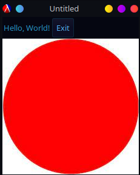
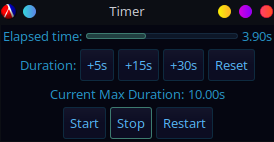

 # gui-easy
 ## A simple package for designing quick and easy GUIs in Racket.
 ## By Gaia Noseworthy

 ## 1. What is gui-easy?
 First uploaded to Github in June 2021, `gui-easy` is a Racket library originally made by Bogdan Popa to make building GUIs in Racket significantly easier. Built using a Declarative GUI model, `gui-easy` provides a simple-to-use and easy-to-master blueprint model for making GUIs.

 ### 1a. What is the purpose of `gui-easy`?
 As many have experienced, Racket is a quite difficult to use language, featuring syntax and methods that can be a headache to think through. Furthermore, the layers of brackets, indentation, and recursion can make thinking through actions in Racket near impossible. Now, imagine building a full, interactive GUI with Racket.

 This is where `gui-easy` comes in. Defining a series of basic, easy-to-use modules and items, it is easy to develop, modify, and release full GUI-based software without such a headache.

 For example,

 ### 1b. How do you use `gui-easy`?
 To make use of `gui-easy`, I will seek to establish two main pieces of knowledge:
 1. How to install `gui-easy`
 2. The fundamentals of creating simple GUIs
 3. The wide number of available modules that one could use in `gui-easy`
 4. An example program in `gui-easy`

 #### Installing `gui-easy`
 Let us begin with loading `gui-easy`. As mentioned in the readme, `gui-easy` can be installed either using the command line interface (CLI) or through Dr. Racket inerface (DRI). As before, ensure that you have Racket downloaded and up to date. You can use your favourite package manager or method for installing Racket, including going to the website to download the latest version, or updating it through Dr. Racket. Once this is done, move onto the methods for installing `gui-easy`.

 ##### Installation Method 1 - CLI
 If you prefer using a command line interface for programming, then you can install `gui-easy` using the following command:
 ```Racket
 raco pkg install gui-easy
 ```

 You can update `gui-easy` using the following line:
 ```Racket
 rack pkg update gui-easy-lib/ gui-easy/
 ```

 Note: This method may not work on Windows-based systems, so it is recommended to try the method below before reporting failure to install.

 ##### Installation Method 2 - DRI
 To install `gui-easy` using the DRI (or easier method for your system):
 1. Open Dr. Racket
 2. Open the "File" menu in the Top Left
 3. Navigate to "Package Manager" and open it
 4. Within the "Do What I Mean" menu, type "gui-easy" into the Package Source box and click "Update"

 ##### Importing `gui-easy`
 Now, you can easily import `gui-easy`. This is most-often done with
  ```Racket
 #lang racket/base
(require racket/gui/easy
         racket/gui/easy/operator)
         ```

 You may need other packages alongside `gui-easy`, a few recommended ones are
 1. `racket/math`
 2. `racket/date`
 3. `plot`

 #### The Fundamentals
 Now, let's say you want to begin building a basic GUI. The first piece that we must discuss is the window and rendering. The window is the object in `gui-easy` that holes everything you create, whether it be buttons, sliders, text, images, or animations. This window, though, must be rendered. Thus, we can create an empty, super simple window by running the command
 ```Racket
 (render
  (window))
 ```

 But this isn't useful for us, we need to introduce some buttons, text, and maybe even images. So, let's first add the text "Hello, World!" into it by using a text object in `gui-easy`.
 ```Racket
 (define textExample (text "Hello, World!"))
 (render
  (window textExample))
 ```

 This code block defines a text object containing "Hello, World!", and then tells Racket to render it within the window. Now, this is useful, but we can do more. Next, let's import the RedCircle.jpg image found in this repo and put it under the text. This can be done with
 ```Racket
 (define redCircle (image "RedCircle.jpg"))
 ```

 We can add this to the window and re-run the code as follows:
 ```Racket
 (render
  (window textExample redCircle))
 ```

 Finally, let's add a button to this code. With the size of the red circle, it would be better to put it next to the text horizontally. So, while we do this, let's put the button into an `hpanel`, which lays out everything inside of it horizontally. (The vertical equivalent is a `vpanel`).

 For this button, we will define it to close the program upon its execution. This requires us to make use of lambda functions. They can be confusing, so we will add them as follows:
 ```Racket
 (define textExample (text "Hello, World!"))
 (define redCircle (image "RedCircle.jpg"))
 (define buttonExample (button "Exit" (λ () (exit))))
 (render
  (window (hpanel textExample buttonExample)
    redCircle))
 ```

 So, with all of this effort, what do we get?

 

 That lambda function, alongside multiple others, are operators in `gui-easy`. What these do is assign operators, which work as follows:
 1. λ - Defined a simple, local lambda function, basically an unnamed single-line function
 2. @ - This converts something into an observable, which is a container for some value that changes over time. This is often a changing text line, such as one next to a counter.
 3. := - This takes one value, o, and changes it to a new value, v. This goes with observables.
 4. <~ - This changes the result of some value, o, by applying it to a function, f
 5. ~> - This returns a new observable whose value changes whenever o does, this is all mapped using the function f.

 So, how do we use these? Well, let us define a simple counter that uses plus and minus buttons, from the `gui-easy` examples:
 ```Racket
 (define (counter @c action)
  (hpanel
   (button "-" (@c . λ<~ . sub1))
   (text (@c . ~> . number->string))
   (button "+" (@c . λ<~ . add1))))
   ```

 What this does is define some counter, that can be referenced using the observable c. This counter holds a horizontal panel featuring:
 1. A minus button, with a function that takes the value in c and updates it by subtracting 1
 2. A label that comes from the result of converting the counter to a string
 3. A plus counter, same as the minus above

 This lays out the basics, and now we can discuss the other modules available.

 #### Other Modules
 Since there are many more modules that cannot all be shown in a simple example, you can find many more of them here:
 1. menu - A simple menu with a label holding many other buttons or options as children
 2. menu-item - The items a menu holds
 3. hpanel - A box that holds items horizontally
 4. vpanel - Same as hpanel but vertically
 5. checkbox - A checkbox that calls an action when toggled
 6. choice - A choice widget with multiple options that calls an action when a decision is made
 7. input - A text field for user input that calls an action when changed
 8. progress - A loading bar
 9. slider - A slider that changes value when dragged
 10. spacer - Fits a region to fill the space horizontally
 11. table - A table of values

 #### An Example Program
 To give a stronger example of this program, I have also included a more useful example of code! In `Timer.rkt`, you will find a file to run a timer partially based on the pre-built timer example for `gui-easy`.[2] This timer works as follows:
 - Starting initially at a duration of 10 seconds, the timer runs when the user clicks "Start"
 - The timer will run until it hits the total duration or until the user clicks "Stop", in which is pauses
 - The user may add to the duration using the "+5s", "+15s", and "+30s" buttons, or reset it to 10s using the "Reset" button
 - If the user wants to reset the timer to 0, they can click "Start"

 This program will look like the photo below:
 

 ## 2. Why gui-easy?
 As said above, it is very difficult to build a GUI, but a functional GUI can be absolutely vital to making a usable, effective program. Furthermore, working with Racket in particular is quite diffiult for users, with a desperate need for improvement. `gui-easy` makes it possible for users to build accessible GUIs to represent the information their programs generate, without making the workload so large that it becomes a burden on the user.

 ## 3. Overall experience?
 Overall, `gui-easy` is a simple to use, accessible program. The official documentation is lacking in examples and details, but the examples in the official GitHub are plentiful and educational. Thus, overall, my experience with `gui-easy` has been overall positive, and gives promise to making a more accessible, functional Racket for future projects.

 ## References
 [1] Bogdan Popa, "gui-easy: Declarative GUIs", https://docs.racket-lang.org/gui-easy/index.html
 [2] Timer Example, https://github.com/Bogdanp/racket-gui-easy/blob/master/examples/7GUI-4-timer.rkt

 ## License
 ```gui-easy is licensed under the 3-Clause BSD license.```
