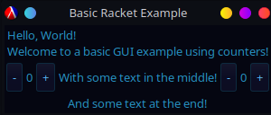

 # gui-easy
 ## A simple package for designing quick and easy GUIs in Racket.
 ## By Gaia Noseworthy

 ## Introduction
 In this GitHub repo, you will be introduced to `gui-easy`[1], a package for building simple, quick GUIs in Racket

 In this document, you will find a summary of this repo, which will include both a wiki section to answer common questions, as well as sample code that serves a rough purpose for both demonstration and usage of `gui-easy`.

 ## Installation
 To install the `gui-easy` package, you can follow either of the two methods below. Ensure to install all dependencies as well, or the code will not run.

 First, ensure that you have Racket downloaded and up to date. You can use your favourite package manager or method for installing Racket, including going to the website to download the latest version, or updating it through Dr. Racket. Once this is done, move onto the methods for installing `gui-easy`.

 ### Method 1 - CLI
 If you prefer using a command line interface for programming, then you can install `gui-easy` using the following command:
 ```Racket
 raco pkg install gui-easy
 ```

 You can update `gui-easy` using the following line:
 ```Racket
 rack pkg update gui-easy-lib/ gui-easy/
 ```

 Note: This method may not work on Windows-based systems, so it is recommended to try the method below before reporting failure to install.

 ### Method 2 - GUI
 To install `gui-easy` using a GUI (or easier method for your system):
 1. Open Dr. Racket
 2. Open the "File" menu in the Top Left
 3. Navigate to "Package Manager" and open it
 4. Within the "Do What I Mean" menu, type "gui-easy" into the Package Source box and click "Update"

 ## How To Use
 To use `gui-easy`, you must first import it with the following line of code:
 ```Racket
 (require racket/gui/easy)
 ```

 Nearly every single `gui-easy` file, though, will make use of various pre-defined operators to make coding simpler. Therefore, it is recommended to actually use
 ```Racket
 (require racket/gui/easy
          racket/gui/easy/operator)
 ```

 You may need other packages alongside `gui-easy`, a few recommended ones are
 1. `racket/math`
 2. `racket/date`
 3. `plot`

 With this done, you are now ready to begin programming! To give a basic example of programming in `gui-easy`, please see "Sample Input/Output" below or view the Demo.rkt file!

 ## Purpose
 The purpose of the code in this repository will be two-fold, and two example files will be provided
 1. To provide a very simple example of generating the most basic possible GUI
 2. To provide a more in-depth example, using `gui-easy` to build...

 For this most basic GUI, we will build a "Hello, World!" file alongside two counters. All of this will be done using the example code from the gui-easy racket-lang page.[1]

 ## Sample Input/Output
 Since this package is designed as a GUI builder, all forms of input and output will be done through the GUI windows created. This windows will build off of the base GUI package making use of the simple methods introduced by the `gui-easy` package.

 For example, let's say we run the Demo.rkt file found in this repository. The code is as follows:
 ```Racket
 #lang racket/base

;First let's import the gui-easy packages
(require racket/gui/easy
         racket/gui/easy/operator)

;Now define a counter as a panel with a minus button, text, and a a plus button
(define (counter @c action)
  (hpanel
   (button "-" (@c . λ<~ . sub1))
   (text (@c . ~> . number->string))
   (button "+" (@c . λ<~ . add1))))

;Now define two counters using the method above
(define @c1 (@ 0))
(define @c2 (@ 0))

;Now define a window with a title, some basic text, two counters with text
;between the counters, and some text at the end
(render
 (window #:title "Basic Racket Example"
  (vpanel
   (text "Hello, World! \nWelcome to a basic GUI example using counters!")
   (hpanel
    (counter @c1 (lambda (proc) (@c1 . <~ . proc)))
    (text "With some text in the middle!")
    (counter @c2 (lambda (proc) (@c2 . <~ . proc))))
   (text "And some text at the end!"))))
 ```

 When this code is run, it produces the following window (on a QT Plasma based machine, some differences should be noticed on other operating systems):

 


 ## References
 [1] Bogdan Popa, "gui-easy: Declarative GUIs", https://docs.racket-lang.org/gui-easy/index.html

 ## License
 ```gui-easy is licensed under the 3-Clause BSD license.```
